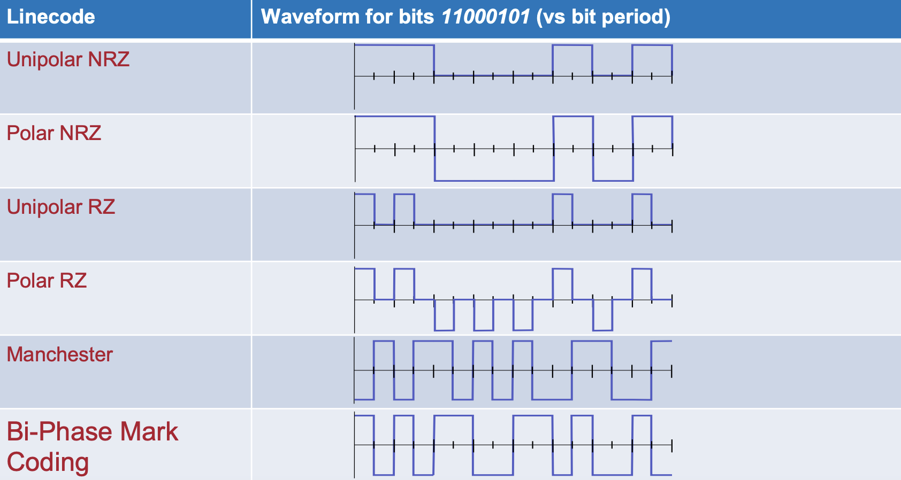

## **Communication Systems**
Times of difference communication:
  * Simplex, Half-duplex, Full-duplex (one way or two-way communication)
  * Serial or Parallel (one signal oath or multiple)
  * Baseband and bandpass (the signal modulated at or around DC, or modulated onto a higher carrier frequency)
    
*Baseband modulation image*

Bandwidth refers to the range of frequencies over which a signal is transmitted or the capacity of a communication channel to carry information.

Channel capacity refers to the maximum rate at which information can be reliably transmitted over a communication channel, normally in bits per second.

Shannon-Hartley theory to calculate channel capacity 
>  C = B log2 ( 1+ SNR) where C is channel capacity in bits per second, B is Bandwidth (Hz) and SNR is Signal-to-noise ratio

**Coding Strategies** 
When we send information over a channel it can be hard to detect if we received the information that was sent correctly. 

Parity check: Add an extra bit to the transmissions so that the number of 1s is either even or odd. 

**Block Coding**
Defined as a (n,m) block code where n is the number of encoded bits and m is the number of data bits. We can implement this using a Generator Matrix (G) and a Parity Check Matrix (H). 
Two Simple Formulas:
 * y = x G (encoding data)
 * s = H yT (calculating the syndrome)
 * y is the code word, x is the data and s is the syndrome

