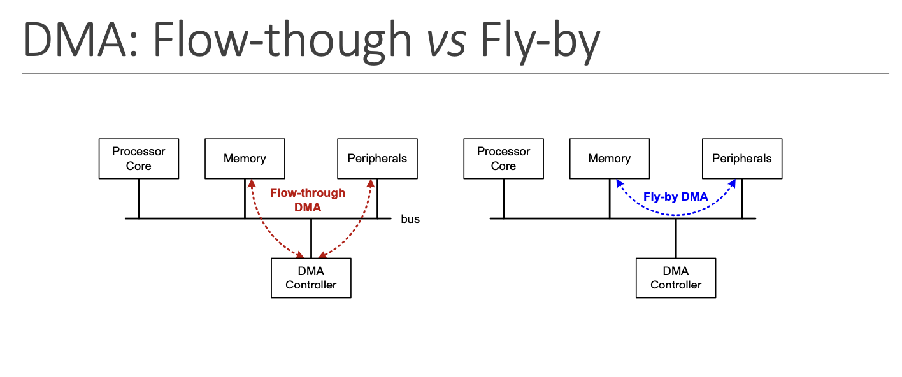

### **Direct Memory Access (DMA)**
DMA allows peripherals to access memory (read or write) without the CPU being involved. This allows for a reduced time latenency for peripheral I/O transactions, allows the CPU to do other operations or to be idle and an idle CPU can be put into low power mode, reducing power consumption. 
However, it requires extra hardware such as the DMA controller and increases the complexity and cost of microcontrollers

## DMA Controller 
Basic Procedures involved in a DMA controller:
  * DMA device requests bus
  * CPU grants bus request
  * CPU takes its signals to HiZ (High Impedance)

Key DMA registers:
  * DMA Memory Address Register (CMAR): holds the memory address where data will be transferred during DMA operations.
  * DMA Peripheral Address Register (CPAR): holds the address of the peripheral device to which data will be transferred to or which will be transferred during a DMA operation.
  * DMA Number of Data Register (CNDTR): holds various aspects of the DMA transfer operation.

DMA incremental mode sets the DMA controller to automatically adjust the memory address after each data transfer.

DMA circular mode sets the DMA controller to continuously loop through a predefined memory buffer or data structure, repeatedly transferring data between memory and a peripheral device.

When does a DMA transfer start? When the peripheral is ready to send or receive data, the peripheral will generate a DMA request signal to the DMA controller to request a data transfer.

## FreeRTOS Fundamentals 
The difference between an RTOS and a Cyclic Executive is that RTOS uses multiple tasks, multiple cyclic executives. 

RTOS allows for concurrent execution multitasking, prioritisation fo threads and processes of executions, Interrupt handling, synchronisation of variables and functions. 

RTOS Kernel: processing core of the RTOS (contains: realtime scheduler, context switching, resource manager and hardware interface).

There are many types of task schedulers: 
  * Priority pre-emptive: allows a task to be interrupted when executing (uses priority of tasks to determine schedule).
  * First in first out
  * Shortest time remaining
  * Round-robin (no sequence)

RTOS Context Switching: The process of saving the context of a task being suspended and restoring the context of a task being resumed
