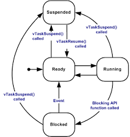

## Martin Exam Revision  
 * 2023, 2022, 2021 and 2019 are relevant exams (2020 is not relevant) 
 * Format almost the same as the last exam
 * 10 Questions 10 marks per question, a 100 mark exam
 * Key Concepts only, not specific information and CLI is not assessed

Review of information:
> Lecture 1: Focus on debouncing here (not just coding, what it is and how you can get rid of it)

> Lecture 2: ADCs remember what is the advantage of this ADC and what is the disadvantage of this ADC. Think about how they work and what are some of the advantages and shortcomings of these?

> Lecture 4: FSMs and Serial Interfaces. Questions related to what is half-duplex and full-duplex, what does it mean if you have a dedicated clock line and what happens if you are missing these lines?

> Lecture 3: How to encode data and basic maths.

> Lecture 5: Expect questions related to the Chanel Capacity -- Noise, bandwidth, synchronisation (transmitter and reciever)

> Lecture 6: DMA questions, Question 9 or 10

> Lecture 7: Some primitives that might make your life easier, what is a scheduler, what is a pre-emptive scheduler, and basic primitives.
> ** Go over the Queuesets ** There will also be some questions related to Memory Management and there are 4/5 so if there's any question related to memory management if you have heap 1 that does not allow memory freeing; what is the short-comings and what are the advantages.
> What is the advantage of using semaphores, when would we use a queue? How does the scheduler work?

FreeROTS depends on a single timer interrupt to generate a timing tick. The longer he talks about a concept then more likely to ask it. Delta-Sigma is not going to be there. 

FreeRTOS Summary
  Tasks: used as concurrent, sequential programming units. (4 states)
  Co-Routine: Similar to a task but shares a stack amongst their co-routines (3 States)
  Semaphore: Provides synchronization and mutual exclusion (Binary, Counting, and Mutex)
  Queue: Used to provide message passing between tasks
  Software Timer: Causes a function to execute after a period of time.
  

Memory Management - 4 Heaps only:
Heap 1 does not allow the freeing of memory
Heap 2 Best fit algorithm and allows memory to be freed
Heap 3 implements Malloc and Free

Task Control Block contains: 
  * Microprocessor registers
  * Task state
  * Task variables
  * Stack variables
If a task is suspended the above needs to be saved
Waveform describing pre-emptive and disabled pre-emptive scheduler.

## Question 1 is digital interfacing - Mainly related to lecture 1 (coding questions are gone now) [Go to Lecture 1 Page](Digital%20IO%20Interfacing.md)
* Do debouncing using hardware (capacitor does not allow a quick change, it doesn't allow high-frequency changes and RC filter is a low pass filter. Typically complemented with a Schmitt trigger some oscillation beyond some threshold can't pass through)
* Potentially question related to what do we need to do to make sure that the pin is not floating (the electromagnetic interference can cause the pin to go magically up and down so what are the mechanisms to set this pin to something more deterministic)
* No GPIO register questions, i.e., how to configure those since we've done enough of these throughout the stages

## Question 2 - World of ADCs and DACs [Go to Lecture 2 Page](Analog%20Interfacing,%20Timing%20Interfacing%20and%20Embedded%20System%20Design.md)
* if you are deciding what ADC you will be able to determine what parameters you will need I.e., precision, accuracy, and resolution.
* Number of levels of the ADC, i.e., what does 12-bit resolution it means there will be 2^12 levels of resolution (amplitude quantization of the signal)
* Low resolution = round to nearest step but this can become quite large
* Time quantization, where Fs > 2Fm. If you don't do sampling correctly you can have signal reconstruction. If Fm = Maximum frequency and to properly reconstruct this signal you have to sample at 2x the rate or higher to get an accurate sampled signal.
> ADC Notes
> Don't expect to fill in the diagram like previous exams, Flash is fast because it has multiple elements that work in parallel. Expensive because of a bunch of resistors and comparators, 8 levels = 3-bit ADC, if you wanted 12 bits you would need 4096 of the resistors and comparators. Difficult to scale due to the component requirements.
> Difference between Flash and Cascase
> ADC Flash Converter Cascade - Coarse mode to differentiate the levels, then use DAC to convert back to analog (i.e. 5V ==> 5.3V, 5.5V) and you can cascade multiple of these in series. Good to avoid the issue of doing everything in parallel, but it comes at the sacrifice of speed.
> Counter Ramp Converter - *If the voltage value I want to convert is low, which might be 0V, as I start going up the ramp I will reach the conversion value very fast, meaning the comparator will be satisfied. If the voltage I want to convert is very high then lots of steps, so a lot of counting and a lot of DAC conversions and will take a while to receive the converted value.* It takes a different amount of time depending on the voltage value.
> Exam Answer: The purpose of the ADC is for the stepping to get to the target voltage, Purpose of DAC: you need DAC for the comparator, analog value to do the comparator and continue or not based on that.
> Successive approximation:  finite state machine to do the subdivisions of the intervals.
> Also revise DACs, the difference between the Weighted Resistor Network Conversion (Using different resistor values to do the conversion, high amount of resistors and different amount of resistors and may be difficult to manufacture) D/A Ladder converter (same resistor and scale it up, and repeat -- Easy to fabricate)

## Question 3 -- PWM
Time spacing interfaces - Measuring the distance of a pulse signal you can then look at the reflection or the echo of that pulse. 
Speed of rotation (Wheel Encoding) - Generate some modulated signal based on the reflected light. Expect signal questions. 
Question-related to the duty cycle, what is a duty cycle, what are the basic parameters of the modulated waveform (duty cycle and period). 
Duty Cycle = Time High / Periood * 100 
You can expect a variation for Question 3c) in the exam. PWM can be used for mimicking voltages by changing the duty cycle on the go. Need to figure out what high time there needs to mimic each of the voltages. If it cannot be achieved say it is impossible or say how to achieve it (i.e., do a voltage inversion) 

## Question 4 -- FSM / Serial Interfacing [Go to Lecture 4 Page](FSM%20Controller%20and%20Serial%20Interfacing.md)
* UART, I^2C, SPI
* Difference between Mealy (Mealy = Current state and input) and Moore (Moore = Current state only)
* Cyclic executives (Disadvantage = Not scalable, difficult to keep adding functionality to one huge block)
* Half-Duplex and Full-Duplex = (Half-duplex is like walkie talkie, communicating one way at a time, Full-Duplex then communication is both ways and simultaneous)
* Serial Interfaces - I2C you always need to specify the address of the device you are talking to, you don't need this in SPI, there are select switches that select the device in which you are communicating to. This has some implications I2C using the address you need to send a lot of data and there is a lot of data redundancy.
* Is UART using a clock line ? If yes what implications does it have, if it doesn't use the clock line does it cause issues?

## Question 5 - Lecture 3 and Lecture 5 [Go to Lecture 5 Page](Noise,%20BW,%20Synchronization,%20CRC,%20Huffman.md) and Lecture 3](Basics%20of%20Communication.md)
* C = B log2 (1 + SNR), easily understood, Impossible to send faster than this rate. SNR = there will always be some noise so that means the SNR can never be infinite. What happens if the Noice is low compared to the Signal etc. Bandwidth = Capturing the highest frequency at which you can send information. The broader the bandwidth the more information you can send through the channel (cannot be infinite).
* Expect something relating to Hamming encoding - Y = x G ; s = H y ^ t ; Y is the code word, x is the data, s is the syndrome.

## Question 6
* Selecting a suitable threshold removes errors
* What communication parameter is limited by slew rate - Slew rate = rate of change, will limit bandwidth. Slew rate will not be able to follow high changes and will smooth out the changes.
* Huffman Encoding (compression) - MPEG and ZIP compressions
* CRC16 -

## Question 7 -- RTOS 
* 5 actions that must be done to perform a context switch
  > 1. Make sure that the Task Control Block is saved 2. Update TCB 3. Restore task control block 
* Preemptive - any state with a higher priority that is in the ready state

  
