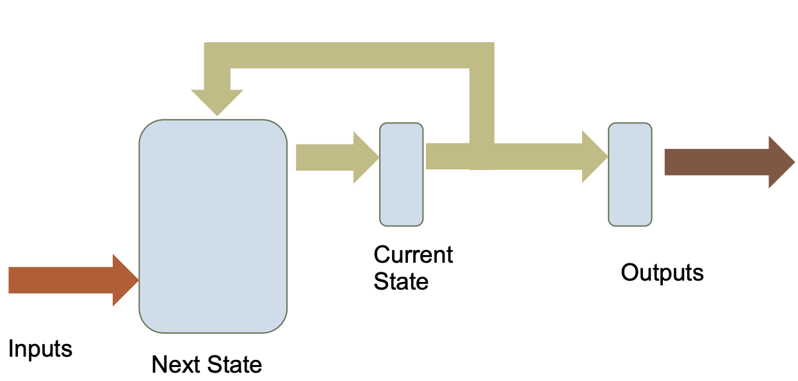
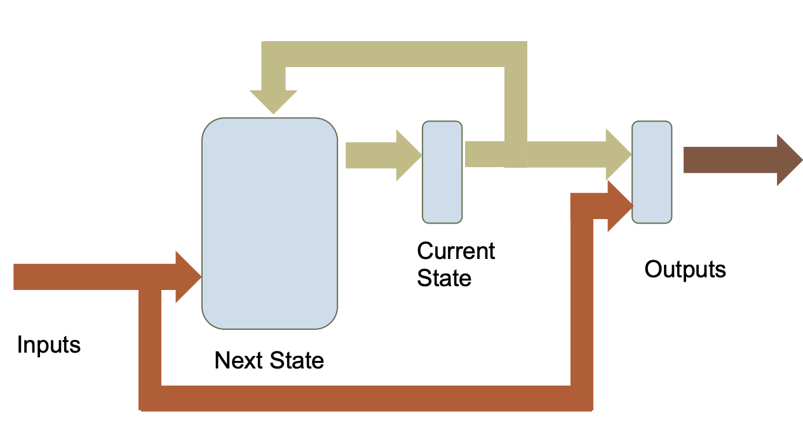

## **Finite State Machine Controllers**
A FSM defines a sequence of operations that can be implemented in software or hardware. 

**Moore Machine** Outputs are dependent on the current state of the controller

**Mealy Machine** Outputs are dependent on current state and current inputs

## **Serial Interfacing** 
Allow communication between digital devices using a sequential-based signalling - e.g. square waves

### Variants 
**Simple Signalling**
> 
